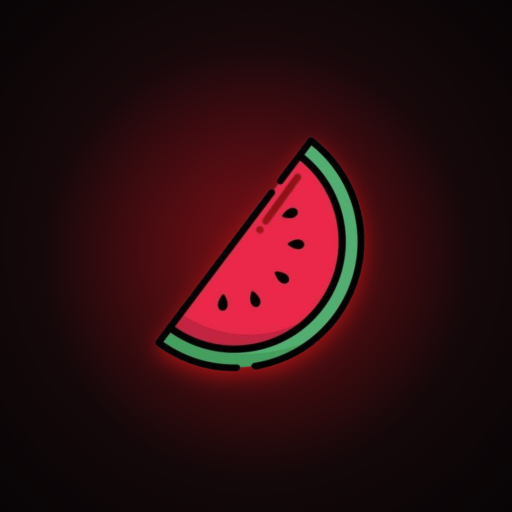
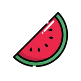
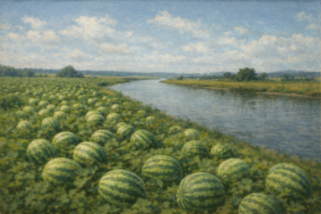

<div align="center">



# 🍉 Watermelon

**Feel the juice.** A dark-first music-streaming app built in Flutter.



[](https://flutter.dev)
[](https://dart.dev)
[](https://riverpod.dev)
[](https://pub.dev/packages/go_router)
[](#)
[](#-license)

</div>

---

## Overview

Watermelon is a fully-designed, **10-screen** music-streaming experience — onboarding, auth, home, search, radio, a full-screen now-playing player, playlists, profile, and subscription. It's built from the **Watermelon Dark** design handoff and faithfully matches the pixel reference.

The app is intentionally **UI-complete but mock-backed**: there's no real audio decoding or backend yet. Playback is simulated behind a `PlayerController`, and all content comes from local sample data behind repository seams — so real audio (`just_audio`) and a real API can drop in later **without touching the UI**.

> **Design philosophy** — Dark only. Red (`#FF1A1A`) is precious: exactly one red action per view. Mono font for every number. 44px minimum tap targets.

---

## ✨ Features

| Screen | Route | Highlights |
|---|---|---|
| 🚀 **Onboarding** | `/onboarding` | Full-bleed hero, gradient display type, page dots |
| 🔐 **Login** | `/login` | Email/password fields, Apple + Google buttons |
| 📝 **Register** | `/register` | Live password-strength meter, terms checkbox |
| 🏠 **Home** | `/home` | Greeting header, filter chips, "jump back in" grid, feature card |
| 🔍 **Search** | `/search` | Recent searches, colored "browse all" category tiles |
| ▶️ **Now Playing** | `/player` | Wine→black gradient, scrubber, full transport controls |
| 📻 **Radio** | `/radio` | Animated **LIVE** hero, popular stations, genre chips |
| 🎵 **Playlist** | `/playlist/:id` | Collapsing 430px hero, tinted now-playing row, per-track likes |
| 👤 **Profile** | `/profile` | Stats, Premium card, playlists grid, settings list |
| 💎 **Subscription** | `/subscription` | Monthly/Annual toggle, selectable plan cards, perks |

Plus two shared components that persist across the tab shell:

- **Mini Player** — frosted bar with a progress tint; tap to open Now Playing.
- **Tab Bar** — Home / Search / Radio / Profile, with a red active state and custom SVG icons.

---

## 🎨 Design system

The look is defined entirely by design tokens in `lib/theme/`:

| Token | Value |
|---|---|
| Brand red (primary) | `#FF1A1A` |
| Accent orange | `#FF6A3D` |
| App background | `#050505` |
| Surfaces | `#0C0C0D` / `#1A1A1A` |
| Player gradient | deep wine → near-black |
| Type | **Inter** (UI) + **JetBrains Mono** (all numbers) via `google_fonts` |

<div align="center">

</div>

---

## 🛠 Tech stack

- **Flutter** 3.44 / **Dart** 3.12
- **flutter_riverpod** — shared player, likes & subscription state
- **go_router** — declarative auth → tabbed-shell → modal navigation
- **google_fonts** — Inter + JetBrains Mono (no bundled `.ttf`)
- **flutter_svg** — 28 custom UI icons
- **flutter_launcher_icons** + **flutter_native_splash** — branding

---

## 📁 Project structure

```
lib/
├─ main.dart            # ProviderScope + MaterialApp.router + AppTheme.dark
├─ router.dart          # go_router: auth flow → tabbed shell → modal routes
├─ theme/               # design tokens (colors, type, spacing, theme, assets)
├─ models/              # track, playlist, station, category, plan
├─ data/                # mock_data.dart — all sample content
├─ state/               # Riverpod: player_controller, likes, subscription
├─ widgets/             # reusable components (mini_player, tab_bar, tiles…)
└─ screens/             # the 10 screens, grouped by feature
```

---

## 🚀 Getting started

### Prerequisites
- Flutter **3.44+** ([install guide](https://docs.flutter.dev/get-started/install))
- Xcode (iOS) and/or Android Studio (Android)

### Configuration (API keys)

Backend keys live in a gitignored **`.env`** file (loaded at runtime via `flutter_dotenv`). Copy the template and fill in your values:

```bash
cp .env.example .env   # .env is gitignored
```

Keys: `SUPABASE_URL`, `SUPABASE_KEY` (anon), `JAMENDO_CLIENT_ID`, `PODCAST_INDEX_API_KEY`, `PODCAST_INDEX_SECRET`, `WATERMELON_API_URL`. Never put a Supabase **service** key in the app. (A compile-time `--dart-define` of the same names also works as a fallback.)

### Run

```bash
# 1. Install dependencies
flutter pub get

# 2. Generate code (Drift database)
dart run build_runner build

# 3. (Optional) regenerate launcher icons & splash
dart run flutter_launcher_icons
dart run flutter_native_splash:create

# 4. Launch (reads .env automatically)
flutter run
```

### Verify

```bash
flutter analyze   # static analysis — should report no issues
flutter test      # widget + state tests
```

---

## 🧭 Roadmap

The architecture leaves a clean seam for each of these:

- [ ] Real audio playback (`just_audio`) behind `PlayerController`
- [ ] Real backend + authentication behind the repository layer
- [ ] Persisted likes (`shared_preferences`)
- [ ] Live local filtering on Search
- [ ] Lock-screen / background playback controls

---

## 👤 Author


**Jayash Bhandary**

[](https://github.com/JayashBhandary)
[](https://www.linkedin.com/in/jayashbhandary/)

---

## 📄 License

Private project — not currently licensed for redistribution.

<div align="center">
<sub>Built with Flutter 🍉 by <a href="https://github.com/JayashBhandary">Jayash Bhandary</a></sub>
</div>
